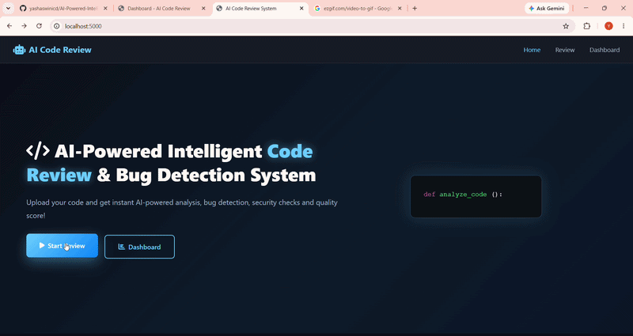

# 🤖 AI-Powered Intelligent Code Review & Bug Detection System

> An AI-powered web application that automatically reviews code,
> detects bugs, checks security vulnerabilities and gives
> quality score with detailed suggestions.

---

## 🎬 Demo

---

## 🌟 Features
...